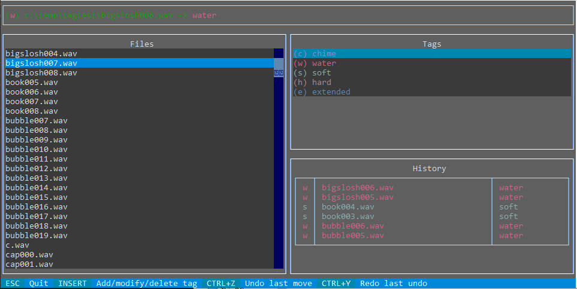

# tagdir

`tagdir` is a simple terminal utility to quickly sort files into directories. Useful if you have a long list of files that need to be quickly sorted through and grouped manually. Uses Textual for a terminal UI.

For example, if you have files:

    field-clack001.wav
    church-bell13.wav
    music-chime12.wav
    ball-thump095-re.wav
    tibetan-bell19.wav
    sample_of_a_ring13.wav
    snap.wav

and you want to sort them into groups:

    chiming/
    dull/

All `tagdir` does is let you set **hotkeys** for target directories, then quickly scroll through a list of files and press the hotkey to send it to that folder. It supports undo and redo, as it can be easy to make slips when doing this quickly.

## Usage

* Run `python tagdir.py <path>` to start running through the files in `<path>`.
    * `<path>/tags.json` will be created automatically.

* Press `Insert` to add a new tag; you'll be prompted to press a hotkey, then type the name of the target folder in the input box.
    * The folder will be created if it does not exist.
* You can edit a tag by pressing `Insert`, using the same hotkey and updating the path.
    * If you make the path blank, the hotkey will be deleted.

* Hotkeys will persist from run to run in `tags.json`, stored in `<path>`.
* `Ctrl-Z` undoes and `Ctrl-Y` redoes.

